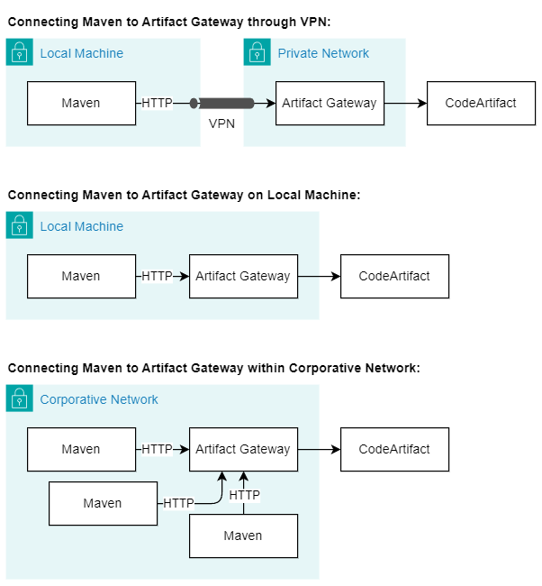

# Artifact Gateway

## Description

Access to CodeArtifact is restricted without an option to disable such behavior, so developers have to configure Maven
to use an authorization mechanism. Since the CodeArtifact token expires every 12 hours, Maven settings need to be
refreshed regularly to maintain access. The **Artifact Gateway** is designed to act as a mediator between artifact
consumers (a developer's local machine, a non-cloud CI/CD, etc.) and CodeArtifact, routing all requests to the service
and equipping them with an authorization token.

Note that the **Artifact Gateway** can be used only within a private network or on your local machine. The details of
usage will be described [below](#connecting-maven-to-artifact-gateway)

## Building Application

```sh
mvn package
```

### Synopsys:

```
artifact-gateway-1.3.0.jar
--aws.codeartifact.domain=<value>
--aws.codeartifact.domainOwner=<value>
--aws.codeartifact.region=<value>
[--aws.accessKeyId=<value> & --aws.secretKey=<value>]
[--server.port=<value>]
```

### Options

- `--aws.accessKeyId`, `--aws.secretKey`. Allow to pass AWS credentials. The application uses
  [the default credential provider chain](https://docs.aws.amazon.com/sdk-for-java/v1/developer-guide/credentials.html#credentials-default),
  so all approaches to provide credentials are available.
- `--server.port`. Allows to change server HTTP port. The default value is 80.

## Running Artifact Gateway

In a simple case, the application can be run by the following command:

```sh
java -jar artifact-gateway-1.3.0.jar --aws.codeartifact.domain=<value> --aws.codeartifact.domainOwner=<value> --aws.codeartifact.region=<value>
```

<!--Alternatively, the Artifact Gateway can be run in a Docker container:

```sh
docker build -t artifact-gateway .
docker run --rm -e ENV DOMAIN=<value> -e DOMAIN_OWNER=<value> -e REGION=<value> -p 80:80 artifact-gateway
```
-->

## Connecting Maven to Artifact Gateway

Once the Artifact Gateway is running, you can configure Maven to access artifacts through it in a normal way
without the authentication need. It is supposed that the URL to your private CodeArtifact repository has already
specified in the `pom.xml`:

```xml
<project>
  <repositories>
      <repository>
          <id>codeartifact</id>
          <!-- Replace 'my-domain', '111122223333', 'us-east-1' and 'my-repository' on the actual values -->
          <url>https://my-domain-111122223333.d.codeartifact.us-east-1.amazonaws.com/maven/my-repository</url>
      </repository>
    ...
  </repositories>
  ...
</project>
```

To enable traffic going through Artifact Gateway, add a `<mirror>` section in Maven's `settings.xml` usually located in
`C:\Users\<username>\.m2` (Windows) or `~/.m2` (Linux, macOS):

```xml
<settings>
    <mirrors>
        <mirror>
            <id>codeartifact-mirror</id>
            <!-- Replace 'my-repository' on the actual repository name-->
            <url>http://<artifact-gateway-ip>/maven/my-repository/
            </url>
            <mirrorOf>codeartifact</mirrorOf>
        </mirror>
        ...
    </mirrors>
    ...
</settings>
```

> **Attention!** The mirror must be configured using the HTTP protocol, not HTTPS, while the CodeArtifact repository URL
> should remain HTTPS.

The value of `<artifact-gateway-ip>` depends on the network architecture you plan to use. There are at least three
possible solutions illustrated in the picture below. In the **first** and **third** solutions, it is assumed that the
Artifact Gateway is deployed on a separate machine, which exposes **a private IP address** that can be used as the value
for `<artifact-gateway-ip>`. In the second solution, the variable must be replaced with `localhost`.

> **Note:** If you specify a custom port when running the JAR file, append the port to the IP address or `localhost`,
> for example, `localhost:4000`.

> **Warning!** Do not deploy the Artifact Gateway on a publicly accessible machine!



## Deploying Application on Server (Amazon Linux)

Copy the JAR-file to the server machine:

```sh
scp -i <rsa-key-file> ./artifact-gateway-1.3.0.jar ec2-user@<server-ip>:/usr/local/
```

Then connect via SSH to the server and execute the script below.

```sh
ssh -i <rsa-key-file> ec2-user@<server-ip>
```

```sh
sudo -i
yum install -y java-17-amazon-corretto
mkdir -R /etc/aws
cat << EOF > /etc/aws/credentials
[default]
aws_access_key_id = <value>
aws_secret_access_key = <value>
EOF
cd /usr/local
curl -O https://gitlab.com/-/project/60610561/uploads/16b8040116b59824f04c5d308a34e4c0/artifact-gateway-1.3.0.jar
cat << EOF > /etc/systemd/system/artifact-gateway.service
[Unit]
Description=Artifact Gateway
[Service]
ExecStart=/usr/bin/java -jar /usr/local/artifact-gateway-1.3.0.jar --aws.codeartifact.domain=<value> --aws.codeartifact.domainOwner=<value> --aws.codeartifact.region=<value>
Restart=always
[Install]
WantedBy=multi-user.target
EOF
systemctl daemon-reload && systemctl enable artifact-gateway
systemctl start artifact-gateway
exit
```